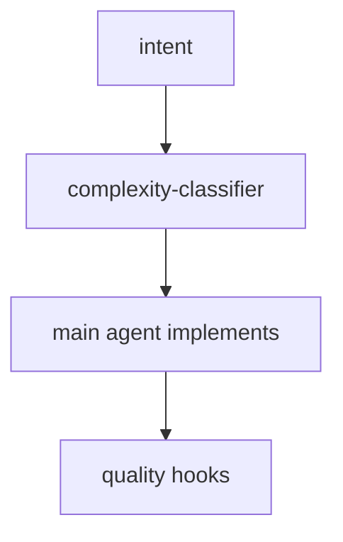
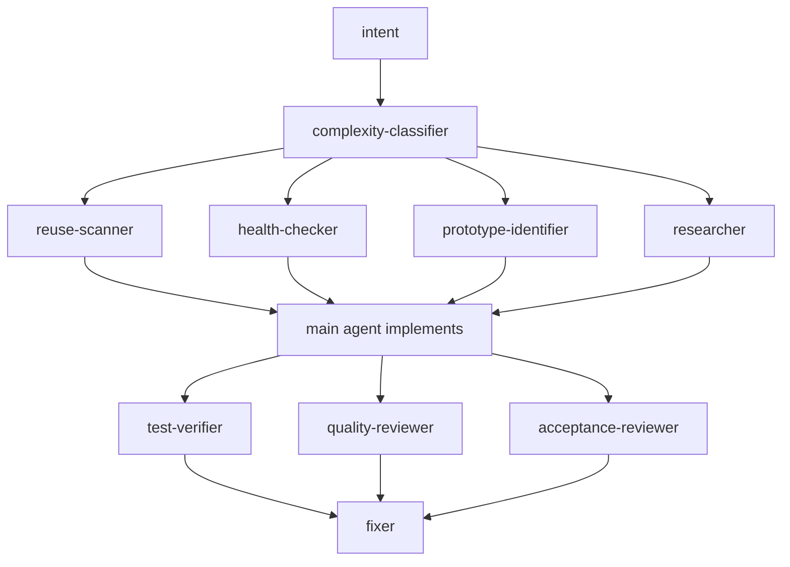
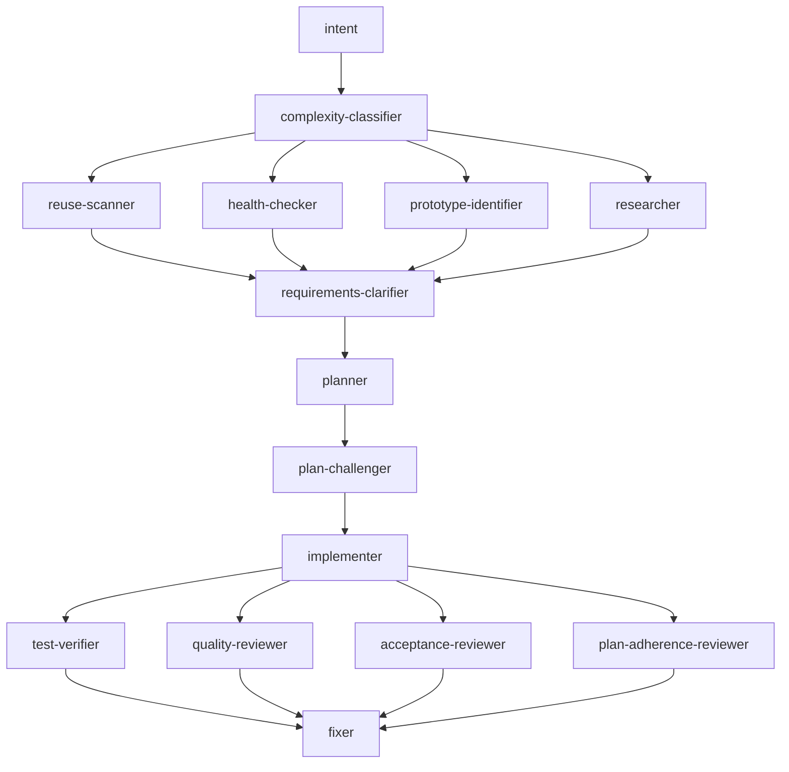
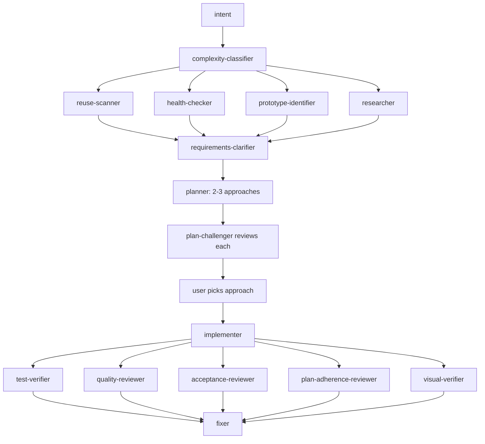

# Alp River

> *A river of agents, sized to the task.*

**Featured in:** [Alper Ortac's AI Stack](https://aistack.to/stacks/alper-ortac-unw0sl)

Multi-stage agent refinement for Claude Code, scaled by automatic complexity classification. Small changes pass quickly. Bigger ones add stages: clarification, planning, adversarial challenge, implementation, broad review, specialist review, self-heal.

The whole pipeline ships in one folder. Doctrine, 26 subagents, 6 slash commands, 8 quality hooks.

## Install

In Claude Code:

```
/plugin marketplace add alp82/alp-river
/plugin install alp-river@alperortac
/reload-plugins
```

To pull updates later:
```
/plugin marketplace update alperortac
/plugin install alp-river@alperortac
/reload-plugins
```

## How to use

Describe what you want. The classifier grades the task and the right stages fire — doctrine is already loaded, nothing to enable.

The river pauses at two checkpoints:

- **Clarifier questions** (L/XL) — answer briefly; the planner waits.
- **Plan selection** (XL) — pick one of the proposed approaches.

Everything else runs to completion. Reviewer findings feed the fixer automatically.

Override the grade with natural language: *treat this as L*, *skip clarify*, *go straight to plan*.

## How the river flows

A complexity classifier reads each task and grades it **S**, **M**, **L**, or **XL**. The grade decides which stages run.

A SessionStart hook reads `AGENTS.md` and injects it into every Claude session as foundational context. Doctrine is always loaded, no per-file imports, no skill matching. A PreCompact hook re-emits doctrine plus the canonical workflow state (intent, classification, approved plan) so it survives compaction.

## S - small

Main agent implements directly. Quality hooks fire on edits.



## M - medium

Pre-flight scans run in parallel. Implementation, then broad review fan-out, then self-heal.



## L - large

Adds clarification, planning, and adversarial challenge. Implementer subagent takes the build. Plan-adherence-reviewer joins the broad review.



## XL - extra large

Planner presents 2-3 approaches. Challenger reviews each. User picks. Visual verifier joins for UI changes.



## Slash commands

```
/alp-river:feature      Full pipeline (L/XL - clarify, plan, challenge, build, review)
/alp-river:fix          Lighter pipeline for fixes and small changes (S/M)
/alp-river:plan         Design-only - stops before implementation
/alp-river:investigate  Root-cause debugging - stops at diagnosis, no patch
/alp-river:review       Review current changes for bugs, dead code, security, conventions
/alp-river:verify       Visual verification of UI changes via playwright-cli
```

## Structure

```
alp-river/
├── .claude-plugin/plugin.json
├── AGENTS.md              <- doctrine + reviewer contract
├── hooks/
│   ├── hooks.json         <- 8 events: SessionStart, PreCompact, PreToolUse, ...
│   └── *.sh               <- inject-doctrine, auto-format, block-git-writes, ...
├── agents/                <- 26 subagent definitions
└── commands/              <- 6 slash commands
```

## Local development

Clone the repo and pass `--plugin-dir`:

```bash
git clone https://github.com/alp82/alp-river.git
claude --plugin-dir ./alp-river
```

## Author

Alper Ortac &middot; [x.com/alperortac](https://x.com/alperortac)
