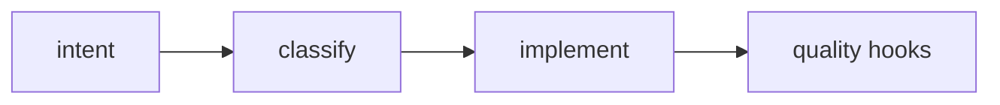
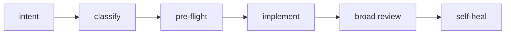
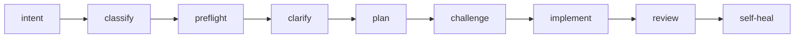
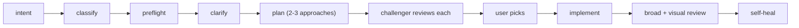

# Alp River

> *A river of agents, sized to the task.*

**Featured in:** [Alper Ortac's AI Stack](https://aistack.to/stacks/alper-ortac-unw0sl)

Multi-stage agent refinement for Claude Code, scaled by automatic complexity classification. Small changes pass quickly. Bigger ones add stages: clarification, planning, adversarial challenge, implementation, broad review, specialist review, self-heal.

The whole pipeline ships in one folder. Doctrine, 26 subagents, 6 slash commands, 8 quality hooks. Drop the plugin in, the pipeline activates. Remove it, everything goes quiet.

## How the river flows

A complexity classifier reads each task and grades it **S**, **M**, **L**, or **XL**. The grade decides which stages run.

A SessionStart hook reads `AGENTS.md` and injects it into every Claude session as foundational context. Doctrine is always loaded, no per-file imports, no skill matching. A PreCompact hook re-emits doctrine plus the canonical workflow state (intent, classification, approved plan) so it survives compaction.

## S - small

Direct implementation through the quality hooks. Main agent handles it without delegation.



## M - medium

Adds pre-flight scans (reuse, health, prototype, research), post-implementation review, and self-heal.



## L - large

Adds clarification, planning, and adversarial plan challenge before implementation. Implementer subagent takes the build.



## XL - extra large

Plan presents 2-3 alternative approaches with diagrams. Challenger reviews each. User picks one. Visual verifier runs if UI changes.



## Install

For now, pass `--plugin-dir` to Claude Code:

```bash
claude --plugin-dir ~/dev/projects/alp-river
```

Or alias it:

```fish
alias claude="claude --plugin-dir ~/dev/projects/alp-river"
```

Marketplace install: TBD.

## Slash commands

```
/alp-river:feature      Full pipeline (L/XL - clarify, plan, challenge, build, review)
/alp-river:fix          Lighter pipeline for fixes and small changes (S/M)
/alp-river:plan         Design-only - stops before implementation
/alp-river:investigate  Root-cause debugging - stops at diagnosis, no patch
/alp-river:review       Review current changes for bugs, dead code, security, conventions
/alp-river:verify       Visual verification of UI changes via playwright-cli
```

## Structure

```
alp-river/
├── .claude-plugin/plugin.json
├── AGENTS.md              <- doctrine + reviewer contract
├── hooks/
│   ├── hooks.json         <- 8 events: SessionStart, PreCompact, PreToolUse, ...
│   └── *.sh               <- inject-doctrine, auto-format, block-git-writes, ...
├── agents/                <- 26 subagent definitions
└── commands/              <- 6 slash commands
```

## Author

Alper Ortac &middot; [x.com/alperortac](https://x.com/alperortac)
