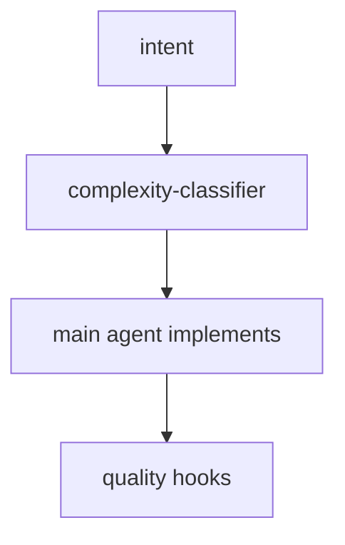
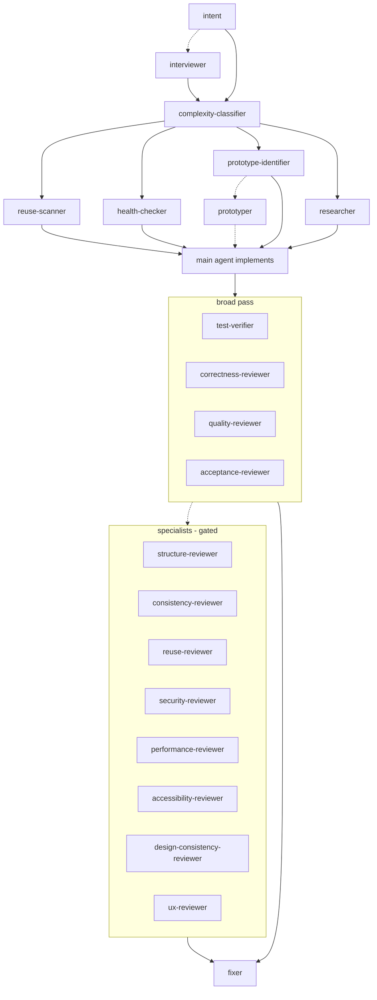
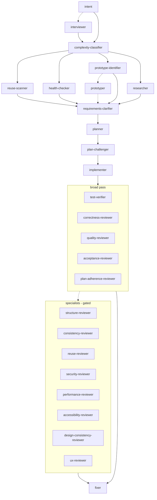
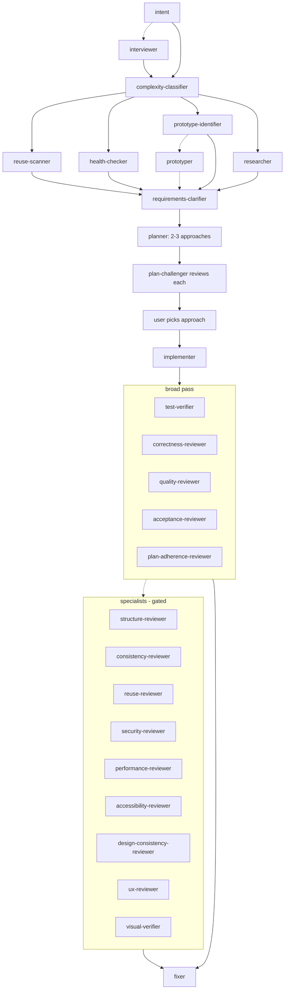

# Alp River

> *A river of agents, sized to the task.*

**Featured in:** [Alper Ortac's AI Stack](https://aistack.to/stacks/alper-ortac-unw0sl)

Multi-stage agent refinement for Claude Code, scaled by automatic complexity classification. Small changes pass quickly. Bigger ones add stages: clarification, planning, adversarial challenge, implementation, broad review, specialist review, self-heal.

The whole pipeline ships in one folder. Doctrine, 27 subagents, 6 slash commands, 8 quality hooks.

## Latest updates

- **0.1.4: clarification loops** - Intent and clarification iterate until you're satisfied. Single-pass Q&A misses the follow-up ambiguity that surfaces from your earlier answers. Agents also research codebase + web first, so questions only surface what those sources can't already answer.
- **0.1.3: two-pass code review** - Correctness asks *does this work?* (bugs, type holes, dead code). Quality asks *is this the right way to do it?* (hacky shortcuts when a clean path exists, bloat, wrong tool for the job). Each reviewer stops sandbagging the other.
- **0.1.2: outcome over mechanics** - Intent confirmation restates the outcome you want, not the mechanics. File paths, function names, schemas: those belong in the plan, not the read-back.

Full history in [CHANGELOG.md](CHANGELOG.md).

## Install

In Claude Code:

```
/plugin marketplace add alp82/alp-river
/plugin install alp-river@alperortac
/reload-plugins
```

To pull updates later:
```
/plugin marketplace update alperortac
/reload-plugins
```

## How to use

Describe what you want. The classifier grades the task and the right specialists fire - doctrine is already loaded, nothing to enable.

Each stage is run by a dedicated agent: classifier judges scope, scanners pre-flight the area, clarifier surfaces ambiguity, planner designs the approach, challenger pokes holes, implementer builds, reviewers cross-check, fixer heals findings.

You stay in the loop at a few well-defined moments:

- **Intent confirmation** (always) - confirm or correct the one-sentence read; an interviewer digs deeper when your request has multiple readings, looping with you (cap 5 rounds) until intent settles and no new aspects emerge.
- **Clarifier questions** (M/L/XL when ambiguity remains) - the clarifier researches the codebase first, then asks only what's still open. It loops with you (cap 5 rounds) until clarity is reached, then the planner runs.
- **Plan selection** (XL) - pick one of the proposed approaches.

Everything else runs to completion. Reviewer findings feed the fixer automatically.

Override the grade with natural language: *treat this as L*, *skip clarify*, *go straight to plan*.

## How the river flows

A complexity classifier reads each task and grades it **S**, **M**, **L**, or **XL**. The grade decides which stages run.

A SessionStart hook reads `AGENTS.md` and injects it into every Claude session as foundational context. Doctrine is always loaded, no per-file imports, no skill matching. A PreCompact hook re-emits doctrine plus the canonical workflow state (intent, classification, approved plan) so it survives compaction.

In every diagram below, **dotted edges are conditional** (a gate fires the agent only when its trigger matches).

## S - small

Main agent implements directly. Quality hooks fire on edits.



## M - medium

Pre-flight scans run in parallel. Implementation, then broad review fan-out, then conditional specialists, then self-heal.



## L - large

Adds clarification, planning, and adversarial challenge. Implementer subagent takes the build. Plan-adherence-reviewer joins the broad pass.



## XL - extra large

Planner presents 2-3 approaches. Challenger reviews each. User picks. Visual verifier joins the specialist pass for UI changes.



## Agents

27 subagents, grouped by stage. Italic = conditional / gated. Tier shows the model that runs by default.

### Intent

| Agent | Tier | Role |
|-------|------|------|
| *interviewer* | opus | Level 2 intent - probes scope, users, success criteria when the request has multiple readings or the Level 1 answer shifts scope. |

### Classify

| Agent | Tier | Role |
|-------|------|------|
| complexity-classifier | opus | Grades each task S / M / L / XL and gates which downstream stages run. |

### Pre-flight

| Agent | Tier | Role |
|-------|------|------|
| reuse-scanner | sonnet | Finds reusable code and quick-win refactors before implementation. |
| health-checker | haiku | Scores code-health of the touched area, surfaces cleanup targets. |
| prototype-identifier | haiku | Flags external APIs / SDK novelty that need a tracer bullet. |
| researcher | haiku | Pulls library / framework / domain knowledge from the web. |
| *prototyper* | sonnet | Builds tracer-bullet prototypes in `.prototypes/` when prototype-identifier flags external surface. |

### Clarify

| Agent | Tier | Role |
|-------|------|------|
| requirements-clarifier | opus | Surfaces ambiguity, edge cases, and proposed acceptance criteria as a numbered question list before the planner runs. |

### Plan

| Agent | Tier | Role |
|-------|------|------|
| planner | opus | Designs the implementation blueprint. On XL, presents 2-3 approaches with a recommendation. |
| plan-challenger | opus | Adversarial review - pokes holes, names failure modes, proposes simpler alternatives. |

### Implement

| Agent | Tier | Role |
|-------|------|------|
| implementer | opus | Executes the approved plan on L/XL. Can kick back to planner via tiered escalation. |
| fixer | sonnet (M) / opus (L/XL) | Applies targeted fixes for findings aggregated from the broad and specialist passes. Emits a re-run set. |

### Broad pass

| Agent | Tier | Role |
|-------|------|------|
| test-verifier | sonnet | Runs the project's test suite, fails fast. |
| correctness-reviewer | sonnet (M) / opus (L/XL) | Bugs, type holes, dead code, project convention adherence. |
| quality-reviewer | opus | Engineering judgment - hacky shortcuts, bloat, wrong tool for the job, unelegant solutions. Reads imports and deps first. |
| acceptance-reviewer | opus | Verifies every requirement and acceptance criterion maps to actual code; flags scope drift. |
| *plan-adherence-reviewer* | sonnet | L/XL only. Checks the implementer followed the plan's file list, signatures, and ordering. |

### Specialist pass (gated)

Each specialist fires only when its trigger matches: a broad-pass finding in its domain, or touched files inside its scope.

| Agent | Tier | Trigger |
|-------|------|---------|
| structure-reviewer | sonnet | Broad pass flagged structure / boundaries; or files / functions over size thresholds. |
| consistency-reviewer | sonnet | Touched files affect naming / error handling / return-shape patterns. |
| reuse-reviewer | sonnet | Broad pass flagged duplication; or new code resembles existing utilities. |
| security-reviewer | opus | Touched files include auth / permissions / session / input handling. |
| performance-reviewer | sonnet | Touched files include database / query / hot-path code. |
| accessibility-reviewer | sonnet | Touched files include UI components. |
| design-consistency-reviewer | sonnet | Touched files include UI components. |
| ux-reviewer | sonnet | Touched files include UI components. |
| visual-verifier | sonnet | XL + UI; uses playwright-cli to screenshot and verify. |

### Investigate (separate flow)

| Agent | Tier | Role |
|-------|------|------|
| investigator | opus | Root-cause debugging - forms hypotheses, attempts minimal repro, traces to the actual cause. Stops at diagnosis; outputs complexity + severity for routing to /fix or /feature. Used by `/investigate`. |

## Slash commands

```
/alp-river:feature      Full pipeline (L/XL - clarify, plan, challenge, build, review)
/alp-river:fix          Lighter pipeline for fixes and small changes (S/M)
/alp-river:plan         Design-only - each stage driven by a specialist agent
/alp-river:investigate  Root-cause debugging - stops at diagnosis, no patch
/alp-river:review       Review current changes for correctness + engineering quality
/alp-river:verify       Visual verification of UI changes via playwright-cli
```

## Structure

```
alp-river/
├── .claude-plugin/plugin.json
├── AGENTS.md              <- doctrine + reviewer contract
├── hooks/
│   ├── hooks.json         <- 8 events: SessionStart, PreCompact, PreToolUse, ...
│   └── *.sh               <- inject-doctrine, auto-format, block-git-writes, ...
├── agents/                <- 27 subagent definitions
└── commands/              <- 6 slash commands
```

## Local development

Clone the repo and pass `--plugin-dir`:

```bash
git clone https://github.com/alp82/alp-river.git
claude --plugin-dir ./alp-river
```

## Author

Alper Ortac &middot; [x.com/alperortac](https://x.com/alperortac)
